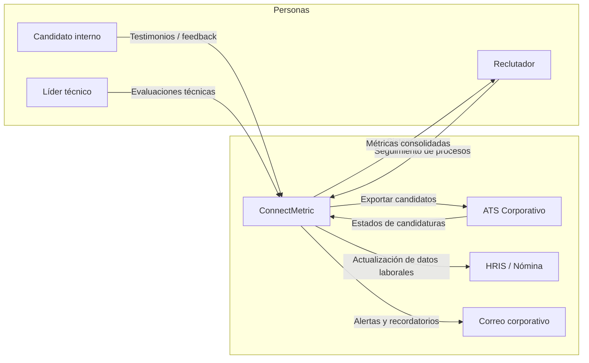
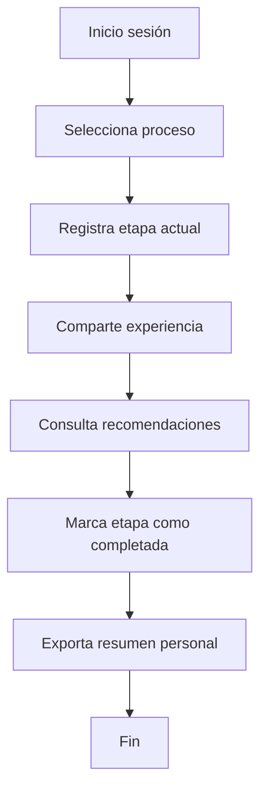
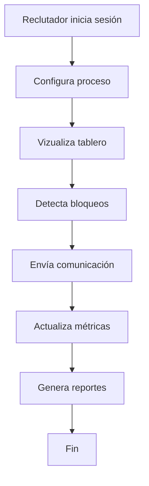
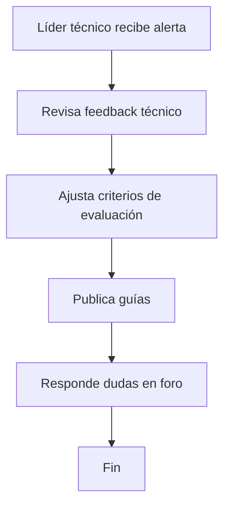

# Entrega 1: Visión, Roles y Planificación Inicial

## 1. Definición del Proyecto

### 1.0 Nombre del producto
- **ConnectMetric**

### 1.1 Descripción del problema y solución
- Reclutadores y candidatos carecen de un espacio confiable para compartir experiencias reales de procesos de selección dentro de la misma organización.
- La comunicación fragmentada impide identificar obstáculos recurrentes y oportunidades de mejora en las evaluaciones internas.
- **ConnectMetric** centraliza testimonios, métricas y recomendaciones prácticas para que los candidatos colaboren y los equipos de talento optimicen sus procesos.

### 1.2 Personas y roles
| Integrante | Rol en Scrum | Responsabilidades principales |
|------------|--------------|-------------------------------|
| Jhon Anderson Marín González | Product Owner / Full Stack | Define visión del producto, prioriza backlog, valida incrementos e implementa funcionalidad de UI y analítica. |
| Alejandro Correa | Scrum Master / Backend | Facilita ceremonias, elimina impedimentos, configura CI/CD y desarrolla APIs, pruebas unitarias y seguridad. |
| Juan José Palacio | Desarrollador Frontend | Implementa vistas responsivas, integra estados de usuario y coordina pruebas de usabilidad. |
| Samuel Granados López | Desarrollador Backend / Data | Modela base de datos, gestiona integraciones externas y crea reportes agregados. |

### 1.3 Público objetivo y contexto
- **Candidatos internos:** empleados postulándose a vacantes internas.
- **Reclutadores / HR Business Partners:** responsables de los procesos de selección.
- **Líder técnico hiring manager:** valida competencias técnicas y asegura la calidad de los feedbacks.
- **Plataformas externas:** (LinkedIn, ATS corporativo, herramientas de RRHH) proveen datos complementarios.

| Actor / Sistema | Descripción |
|-----------------|-------------|
| Candidato interno | Registra avances por etapa, comparte experiencias y recibe sugerencias personalizadas. |
| Reclutador | Monitorea indicadores de satisfacción, identifica bloqueos y solicita retroalimentación. |
| Líder técnico | Documenta evaluaciones técnicas, actualiza lineamientos y responde preguntas frecuentes. |
| ATS corporativo | Fuente de verdad de estados formales; se sincroniza para evitar duplicidad de datos. |
| HRIS / Nómina | Aporta datos laborales y políticas vigentes que afectan elegibilidad. |
| Correo corporativo | Canal de notificaciones para recordatorios y alertas de acción. |

### 1.4 Descripción del proceso de interacción

## 2. Exploración de antecedentes

| Producto | URL | Diferenciador vs. ConnectMetric |
|----------|-----|---------------------------------|
| Glassdoor | https://www.glassdoor.com | Gran base pública, pero limitada al feedback externo y no permite gestionar procesos internos específicos por empresa. |
| Blind | https://teamblind.com | Comunidad anónima para profesionales tech; carece de flujos formales y no integra métricas internas de la empresa. |
| Levels.fyi | https://www.levels.fyi | Comparte compensaciones y ladder de carrera, pero no cubre el acompañamiento por etapa ni colaboración en tiempo real. |

## 3. Planificación Ágil

### 3.1 Ceremonias ágiles
| Ceremonia | Frecuencia | Objetivos | Participantes |
|-----------|------------|-----------|---------------|
| Sprint Planning | Cada 2 semanas (lunes 9:00) | Seleccionar HU, definir objetivo del sprint y estimaciones. | Equipo completo + Product Owner. |
| Daily Scrum | Diario (15 min, 8:45) | Sincronizar avances, identificar impedimentos. | Equipo de desarrollo + Scrum Master. |
| Sprint Review | Fin de sprint (viernes 16:00) | Presentar incremento, recopilar feedback del PO y stakeholders. | Equipo, Product Owner, HR sponsor. |
| Sprint Retrospective | Fin de sprint (viernes 17:00) | Evaluar proceso, definir mejoras accionables. | Equipo completo. |
| Weekly con PO y Líder Técnico | Miércoles 10:00 | Alinear roadmap, validar decisiones técnicas y recibir coaching. | Scrum Master, PO, Líder técnico corporativo. |

### 3.2 Visión de producto y User Story Mapping
- **Declaración de visión:** “Para candidatos internos y equipos de talento humano que necesitan transparencia y colaboración durante los procesos de selección, ConnectMetric es una plataforma centralizada que ofrece feedback estructurado, métricas accionables y guías prácticas. A diferencia de foros externos, ConnectMetric reside dentro de la organización, protege la confidencialidad y habilita mejoras continuas en la experiencia del candidato.”
- **Resultados clave (OKR iniciales):**
  1. Alcanzar 80% de candidatos internos registrando feedback en la primera iteración piloto.
  2. Reducir en 25% el tiempo promedio entre etapas mediante alertas proactivas.
  3. Obtener NPS ≥ 40 de candidatos y ≥ 60 de reclutadores tras 3 meses de uso.
- **Suposiciones clave:** Cultura dispuesta a compartir información, disponibilidad de datos del ATS, patrocinio de HR para adopción.

**User Story Mapping (extracto)**

| Actividad | Paso clave | Historias asociadas |
|-----------|------------|---------------------|
| Preparar perfil | Configurar perfil profesional | HU-01, HU-04 |
| Explorar procesos | Visualizar procesos activos | HU-02, HU-05, HU-06 |
| Registrar experiencia | Actualizar etapa, dejar feedback | HU-07, HU-08, HU-09, HU-10 |
| Colaborar | Interactuar con peers y mentores | HU-11, HU-12 |
| Analizar métricas | Monitorear indicadores, exportar | HU-13, HU-14, HU-15 |
| Administrar plataforma | Definir políticas, integrar sistemas | HU-16, HU-17, HU-18, HU-19, HU-20 |

### 3.3 Backlog de producto (20 HU mínimas)

| ID | Tipo | Prioridad | Historia de Usuario |
|----|------|-----------|---------------------|
| HU-01 | Funcional | Alta | Como candidato quiero completar mi perfil profesional para que las recomendaciones sean personalizadas. |
| HU-02 | Funcional | Alta | Como candidato quiero ver mis procesos activos para entender el estado actual de cada postulación. |
| HU-03 | Funcional | Alta | Como candidato quiero recibir recordatorios de fechas límite para no perder etapas críticas. |
| HU-04 | Funcional | Media | Como candidato quiero adjuntar documentos relevantes para facilitar las validaciones. |
| HU-05 | Funcional | Alta | Como reclutador quiero crear procesos de selección con etapas configurables para adaptarlos a cada rol. |
| HU-06 | Funcional | Alta | Como reclutador quiero asignar candidatos a procesos para centralizar la gestión. |
| HU-07 | Funcional | Alta | Como candidato quiero registrar feedback por etapa para brindar información útil a otros participantes. |
| HU-08 | Funcional | Media | Como candidato quiero marcar una etapa como completada para seguir el flujo sugerido. |
| HU-09 | Funcional | Media | Como candidato quiero valorar la utilidad del feedback recibido para mejorar futuras recomendaciones. |
| HU-10 | Funcional | Alta | Como candidato quiero consultar una guía de preparación por etapa para presentarme con mayor seguridad. |
| HU-11 | Funcional | Media | Como candidato quiero responder preguntas de otros candidatos para construir comunidad. |
| HU-12 | Funcional | Baja | Como candidato quiero seguir a mentores específicos para recibir notificaciones de sus aportes. |
| HU-13 | Funcional | Media | Como reclutador quiero ver métricas agregadas por proceso para detectar cuellos de botella. |
| HU-14 | Funcional | Media | Como reclutador quiero exportar reportes en CSV para compartir con liderazgo. |
| HU-15 | Funcional | Baja | Como reclutador quiero configurar encuestas de satisfacción para medir percepción. |
| HU-16 | No Funcional | Alta | Como administrador quiero que la plataforma soporte autenticación corporativa SSO para cumplir políticas de seguridad. |
| HU-17 | No Funcional | Alta | Como administrador quiero que las comunicaciones cumplan con estándares de accesibilidad AA. |
| HU-18 | No Funcional | Media | Como administrador quiero disponibilidad del 99% para garantizar continuidad del servicio. |
| HU-19 | No Funcional | Media | Como administrador quiero auditoría de acciones para cumplir revisiones internas. |
| HU-20 | No Funcional | Baja | Como administrador quiero monitorear desempeño del sistema para reaccionar ante degradaciones. |

### 3.4 Sprint Backlog (Sprint 1)

| HU | Condiciones de aceptación resumidas | Responsable | Tareas principales |
|----|------------------------------------|-------------|-------------------|
| HU-01 | Perfil editable con campos obligatorios (nombre, rol, skills). Validación de datos. | Juan José | Diseñar formulario, implementar vista Django, validar frontend. |
| HU-02 | Dashboard lista procesos del usuario con estado y próxima acción. | Jhon Anderson | Definir modelo de datos, construir consulta, maquetar tarjetas en frontend. |
| HU-05 | Reclutador crea proceso con nombre, descripción y etapas personalizadas. | Alejandro | Diseñar modelos, crear CRUD en admin, exponer endpoint REST. |
| HU-06 | Reclutador asigna candidatos existentes a procesos; validación de duplicados. | Samuel | Implementar relación en BD, formularios, pruebas de integridad. |
| HU-07 | Candidato registra feedback texto + valoración por etapa. | Juan José | Crear formulario, guardar en BD, mostrar historial. |
| HU-16 | SSO corporativo funcional con fallback a auth local para testing. | Alejandro | Configurar Azure AD / SAML, actualizar settings, documentar configuración. |

**Tareas transversales Sprint 1**
- Configuración de CI/CD básico (GitHub Actions) – responsable: Alejandro.
- Pruebas unitarias iniciales para módulos creados – responsables: todos.
- Documentación técnica en README y Wiki – responsable: Jhon.

## 4. Sketches iniciales
- Se detalla a alto nivel cada vista en `docs/entrega1/sketches.md`. Incluye mockups en texto y enlaces de referencia a prototipos creados en Figma.
- Pantallas cubiertas: Login SSO, Dashboard de candidatos, Detalle de proceso, Registro de feedback, Tablero de reclutador, Panel de métricas.

## 5. Pruebas de aceptación (versión inicial)

| ID | Escenario | Pasos de prueba | Resultado esperado |
|----|-----------|-----------------|--------------------|
| TC-01 | Creación de proceso | 1. Iniciar sesión como reclutador. 2. Ir a "Crear proceso". 3. Completar campos obligatorios. 4. Guardar. | El proceso aparece en la lista con las etapas definidas. |
| TC-02 | Registro de feedback | 1. Iniciar sesión como candidato. 2. Abrir proceso activo. 3. Seleccionar etapa. 4. Registrar feedback y guardar. | El feedback queda asociado a la etapa y visible en el historial. |
| TC-03 | Consulta de guía por etapa | 1. Iniciar sesión como candidato. 2. Abrir etapa pendiente. 3. Abrir pestaña "Preparación". | Se muestra contenido de soporte contextual. |
| TC-04 | Asignar candidato a proceso | 1. Iniciar sesión como reclutador. 2. Editar proceso. 3. Añadir candidato. | El candidato queda asociado y visible en la lista del proceso. |
| TC-05 | Notificaciones temporizadas | 1. Configurar recordatorio para una etapa. 2. Adelantar fecha (entorno de prueba). | Se envía notificación al candidato a través del canal configurado. |
| TC-06 | Ingreso por SSO | 1. Acceder vía login corporativo. 2. Autenticarse con credenciales Azure AD. | Redirección exitosa al dashboard sin solicitar contraseña interna. |

## 6. Prueba de concepto (PoC)
- **Objetivo:** validar stack Django + PostgreSQL + autenticación corporativa con integración de mensajería.
- **Alcance logrado:**
  - Proyecto Django configurado y ejecutando `python manage.py runserver` en entorno local.
  - Migraciones iniciales aplicadas (`python manage.py migrate`).
  - Creación de superusuario para validar flujo administrativo.
  - Prueba de integración con proveedor SMTP de pruebas (Mailtrap) para notificaciones.
- **Hallazgos:** se requiere caching para métricas agregadas, y definir con Seguridad corporativa el esquema de SSO (posible Azure AD + OAuth2).

## 7. Referencias y fuentes
- Documentación Django: https://docs.djangoproject.com/
- Azure Active Directory SSO: https://learn.microsoft.com/azure/active-directory/
- Glassdoor, Blind, Levels.fyi (consultadas 2025-10-14).
- Generación asistida por IA (GitHub Copilot / GPT-5-Codex) para redacción de secciones descriptivas.

---

> Nota: Antes de la entrega final, eliminar indicaciones de plantillas, actualizar tabla de contenidos automática y adjuntar capturas/screen recordings en los repositorios correspondientes.
