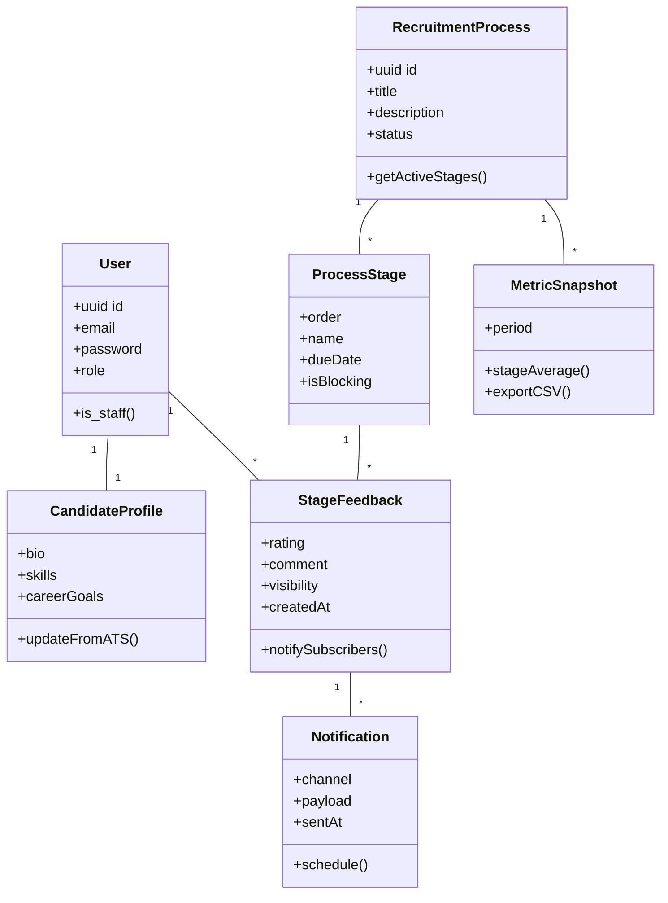
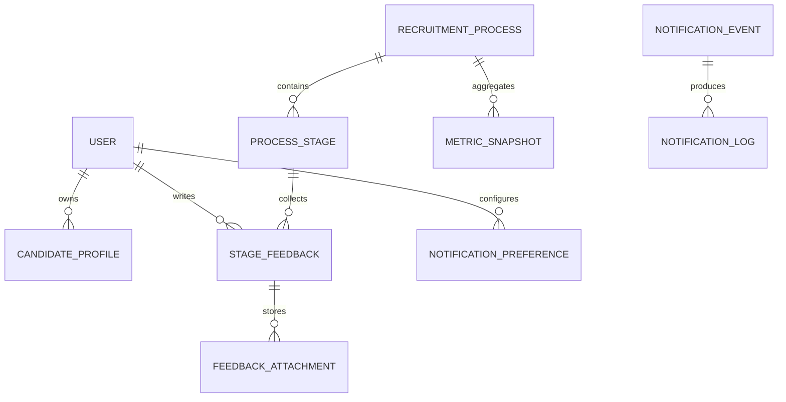
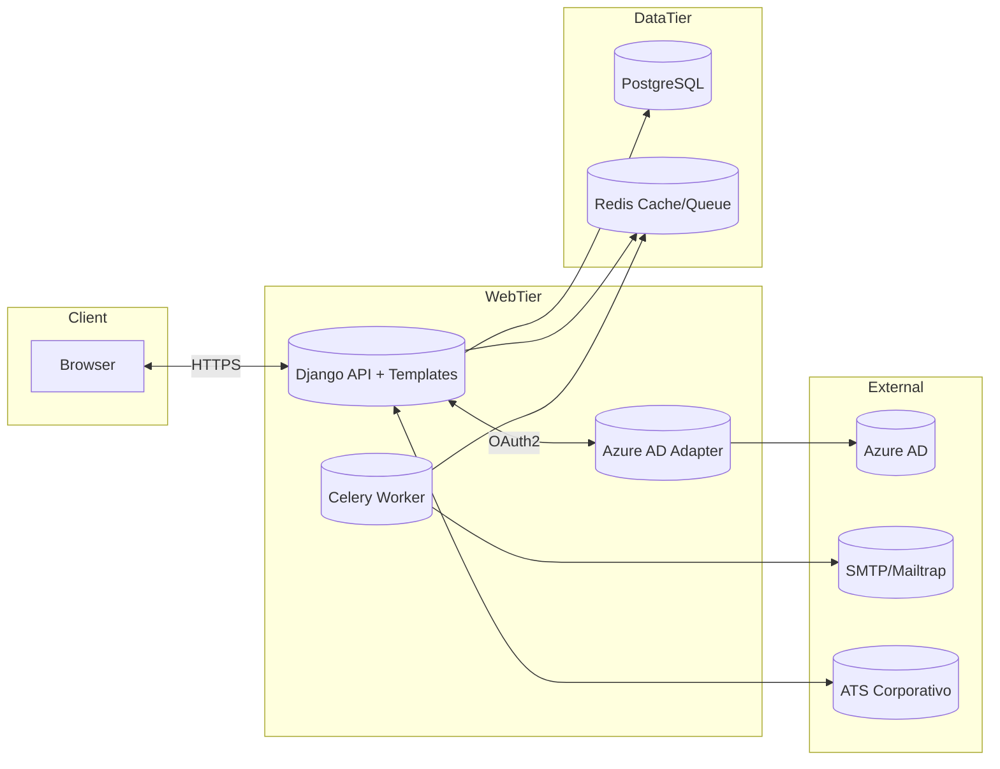

# Entrega 2: Arquitectura y Avances de Implementación

## 1. Cono de la Incertidumbre y análisis del template

| Feature clave | Historias de usuario asociadas | Conocimiento tecnológico | Conocimiento del dominio | Riesgo percibido | Estrategia de mitigación |
|---------------|--------------------------------|---------------------------|---------------------------|------------------|---------------------------|
| Registro y socialización de feedback entre candidatos | HU-01, HU-07, HU-09, HU-11 | Alto (equipo domina Django, ORM y plantillas) | Medio (se requiere validar políticas de HR para la divulgación) | Medio | Sesión quincenal con HR sponsor para validar lineamientos de confidencialidad. |
| Tablero de procesos para reclutadores | HU-05, HU-06, HU-13, HU-14 | Medio (se están consolidando consultas complejas y gráficas) | Alto (PO tiene experiencia en procesos internos) | Medio | Prototipo temprano en staging y pruebas con datos ficticios antes de exponer productivo. |
| Integración con autenticación corporativa SSO | HU-16 | Bajo (primer proyecto con Azure AD) | Alto (equipo conoce el flujo de onboarding) | Alto | Prueba de concepto aislada, soporte del equipo de infraestructura y revisión de seguridad antes de la entrega final. |
| Módulo de notificaciones y recordatorios | HU-03, HU-10, HU-15 | Medio (uso de Celery/SMTP) | Medio | Medio | Implementar colas en entorno local, validar límites de envío y definir fallback por correo manual. |
| Métricas y exportación de reportes | HU-13, HU-14, HU-20 | Medio | Bajo | Medio | Pair programming con el integrante Data, spike técnico sobre agregaciones y caché. |

**Análisis:** El cono evidencia mayor incertidumbre en la integración SSO y en el módulo de métricas porque combinan tecnologías nuevas (OAuth2 con Azure AD y cálculos agregados sobre feedback) y requieren aprobación corporativa. Se planificaron spikes y soporte de expertos para reducir el riesgo antes del siguiente release.

## 2. Aspectos generales del documento

**Nombre del sistema:** ConnectMetric.

**Propósito:** acordar una arquitectura compartida que guíe la implementación del reto, asegurando consistencia entre los miembros del equipo y facilitando la toma de decisiones de diseño.

**Vistas cubiertas:**
- **Vista lógica:** clases de diseño y modelo de datos que representan los conceptos centrales.
- **Vista física:** componentes desplegados, nodos de procesamiento y su distribución en entornos desarrollo / staging / producción.

## 3. Evaluación del sprint anterior (Sprint 1)

**Técnica de retrospectiva utilizada:** Start / Stop / Continue con votación por puntos.

| Start | Stop | Continue |
|-------|------|----------|
| Formalizar spikes técnicos (SSO, colas de notificación). | Mezclar discusiones de UX dentro de la daily (pasaron de 15 a 30 min). | Documentar decisiones en el canal #arquitectura y registrar acuerdos en Confluence. |
| Integrar pruebas unitarias al pipeline de GitHub Actions. | Abrir issues sin criterios de aceptación claros. | Revisiones cruzadas obligatorias (code review de al menos un par). |
| Revisión conjunta de datos de prueba antes de las demos. | | Mostrar demo funcional al PO 24h antes de la review para evitar sorpresas. |

**Acciones de mejora comprometidas:**
1. Agregar plantilla de criterios de aceptación en cada historia nueva.
2. Configurar job de test en CI (pytest + coverage básico).
3. Agendar sesión técnica con equipo de infraestructura para acelerar SSO.

## 4. Planificación del sprint actual (Sprint 2)

**Historias seleccionadas:** HU-02, HU-03, HU-07, HU-10, HU-13, HU-16, HU-18.

**Objetivo del sprint:** habilitar el flujo completo para que un candidato registre feedback, reciba recordatorios y que el reclutador visualice métricas preliminares bajo autenticación corporativa.

**Evidencias SCRUM:**
- Capturas de la planificación y estimación (planning poker) guardadas en `docs/entrega2/img/planning_poker.png` y `docs/entrega2/img/sprint_board.png`. *(Agregar capturas antes de entregar.)*
- Sprint backlog activo: [GitHub Project "ConnectMetric" Sprint 2](https://github.com/users/Anderseon/projects/1/views/2).

**Cambios en el backlog:** se re-priorizaron HU-11 y HU-12 para Sprint 3. Se añadieron tareas técnicas para endurecer seguridad (límites de subida y sanitización de entradas).

## 5. Diseño arquitectónico

### 5.1 Estilos arquitectónicos y tecnologías

| Aspecto | Selección | Justificación / implicaciones |
|---------|-----------|--------------------------------|
| Tipo de aplicación | Web responsiva (SPA ligera sobre Django templates + HTMX) | Flexibilidad para iterar y compatibilidad con dispositivos corporativos. |
| Estilos arquitectónicos | **Layered** (Presentación, Dominio, Persistencia), **Client/Server**, **RESTful services**, **Event-driven** (notificaciones) | Permite separar responsabilidades, favorecer pruebas y escalar servicios críticos como notificaciones. |
| Lenguajes y frameworks | Backend: Python 3.12 + Django 5; Frontend: HTML5, Tailwind, HTMX; Jobs asíncronos: Celery + Redis; Testing: Pytest + Django TestCase | Stack conocido por el equipo, soporte maduro y ecosistema seguro. |
| Persistencia | PostgreSQL 15 (relacional), Redis (cache y cola de tareas) | PostgreSQL asegura integridad referencial; Redis habilita TTL para recordatorios y reduce latencia en dashboards. |
| Integraciones externas | Azure AD (SSO OAuth2), Mailtrap / SMTP corporativo, posible API ATS | Se definen wrappers y adaptadores para desacoplar dependencias externas. |

### 5.2 Vista lógica – diagrama de clases de diseño



### 5.3 Vista lógica – modelo de datos



**Notas:**
- `USER` extiende el modelo `AbstractUser` de Django con campos de rol.
- `METRIC_SNAPSHOT` almacena resultados pre-procesados para dashboards.
- `NOTIFICATION_EVENT` contiene disparadores (recordatorios, avisos de etapa completada) que se encolan en Celery.

### 5.4 Vista física – componentes y despliegue

**Diagrama de componentes**



**Diagrama de despliegue**

```mermaid
graph TD
    DevLaptop[Dev Laptops] --> DockerStack[Docker Compose (web + worker + db + redis)]
    DockerStack --> GitHubActions[GitHub Actions CI/CD]
    GitHubActions --> Staging[Azure Web App (staging)]
    Staging --> Prod[Azure Web App (production)]
    Prod --> CorpUsers[Candidatos/Reclutadores]
    Prod --> CorpSystems[ATS / HRIS]
```

## 6. Avances de implementación (>= 50%)

1. **Repositorio público:** https://github.com/Anderseon/ConnectMetric
2. **Funcionalidades demostrables:**
   - Autenticación y registro básico (`authentication/views.py`, `authentication/templates`).
   - Dashboard de candidatos con procesos y avances (`blog/views.py`, `templates/blog/dashboard.html`).
   - Registro de feedback y visualización histórica (`user/views.py`, `templates/user/profile.html`).
   - Administración de procesos y etapas desde Django Admin (`blog/admin.py`).
3. **Justificación de la arquitectura:**
   - Separación de apps Django (`authentication`, `blog`, `user`) materializa la vista por capas: autenticación, dominio de procesos y relación usuario-proceso.
   - Uso de `Celery` planificado; actualmente se generó configuración básica (`ConnectMetric/settings.py`) y se documentó el worker para sprint siguiente.
4. **Estructura del proyecto:**

```text
ConnectMetric/
├─ ConnectMetric/        # Configuración global, settings, URLs, wsgi/asgi
├─ authentication/       # Módulo de login, sesiones y templates de acceso
├─ blog/                 # Administración de procesos, dashboards y vistas de HR
├─ user/                 # Perfil de usuario, feedback y colaboraciones
├─ static/               # Recursos estáticos
├─ templates/            # Base layout y plantillas compartidas
└─ docs/                 # Documentación del reto (entregas, sketches)
```

5. **Capturas y demo:**
   - Guardar en `docs/entrega2/img/` las capturas de:
     - Login corporativo (mock).
     - Dashboard de candidato con procesos.
     - Lista de feedback y formulario de registro.
     - Vista de métricas preliminares para HR.
   - Durante la sustentación se mostrará la ejecución local con acceso a datos (listar procesos desde BD, crear feedback, actualizar estado).

## 7. Conclusiones y lecciones aprendidas

- La planificación basada en incertidumbre permitió concentrar esfuerzos en SSO y métricas, evitando desvíos en funcionalidades menos críticas.
- Las sesiones Start/Stop/Continue redujeron tiempos muertos y facilitaron la coordinación de pruebas antes de la review.
- Mantener módulos separados por responsabilidad en Django redujo conflictos de merge y aceleró el on-boarding de integrantes.
- Integrar los test en GitHub Actions dio visibilidad sobre regresiones tempranas.

## 8. Referencias

- Kruchten, P. "The 4+1 View Model of Architecture" (IEEE Software).
- Django documentation: https://docs.djangoproject.com/
- Azure AD OAuth2: https://learn.microsoft.com/azure/active-directory/develop/
- Celery Docs: https://docs.celeryq.dev/
- Redis for Python: https://redis.io/docs/interact/programmability/python/
- HTMX Docs: https://htmx.org/docs/
- GitHub Actions for Django CI: https://docs.github.com/actions

---

> **Acciones pendientes para la entrega:** anexar capturas en `docs/entrega2/img/` y actualizar el enlace al Sprint 2 si cambia el identificador del tablero.
